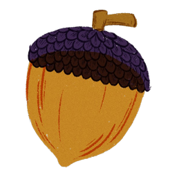

<h1 align="center">
   linux-based terminal portfolio
</h1>
<p align="center">
  A terminal-style personal site~ browse projects, chase hidden acorns, and pretend you're on Debian.
</p>

<!--  -->


This is a template for a static, interactive portfolio that looks and feels like a Linux terminal. Land on a `fastfetch`-style splash and explore your world with real shell commands — `cd`, `ls`, `cat`, `tree`, etc. — instead of clicking through menus.

There are no frameworks and no build step. Just HTML, CSS, and a single JavaScript file that powers a virtual filesystem, hidden collectibles, and a pile of reflex-test commands for the curious.

## Features

- **Interactive terminal** — type commands, tab-complete paths, scroll command history with ↑/↓
- **Virtual filesystem** — `projects/`, `achievements/`, `certificates/`, dotfiles, and hidden files
- **fastfetch boot** — system info panel + colored ASCII squirrel (pet it for an acorn)
- **Acorn hunt** — 10 hidden collectibles; progress saved in `localStorage`; type `acorns` for hints
- **Easter eggs** — `vim`, `sl`, `cowsay`, `fortune`, `cmatrix`, Konami code, and friends (not listed in `help` on purpose)
- **Optional sound** — `sound on` for keyboard clicks and a terminal bell on errors
- **Fixed-width layout** — centered terminal window; prompt stays put even after `clear`

## Customisation

Everything lives in two files. No bundler required.

### `script.js`

| What | Where |
|------|--------|
| **Your files & folders** | `FS_ROOT` — add directories, `.txt` files, HTML links, hidden dotfiles |
| **Birthday & uptime** | `BIRTHDATE` — drives `uptime` and a birthday banner on load |
| **Fortune cookies** | `FORTUNES` array |
| **Acorn hints** | `ACORN_HINTS` — cryptic clues for unfound collectibles |
| **Dig reward text** | `dig` command — personal note unlocked by the `.secrets` riddle |
| **New commands** | `COMMANDS` object — add handlers; hide from tab completion via `HIDDEN_COMMANDS` |

File nodes support an optional `acornId` field to award a collectible when someone `cat`s them:

```js
".acorns": {
  type: "file",
  acornId: "stash",
  content: "you found the stash.\n...",
},
```

### `index.html`

| What | Where |
|------|--------|
| **Colours** | `:root` CSS variables (`--accent`, `--purple`, `--purple-bright`, …) |
| **fastfetch panel** | `#fastfetchTemplate` — OS, host, kernel, links, color swatches |
| **Squirrel art** | `.ascii-art` block inside the template |
| **Favicon** | `<link rel="icon" href="images/acorn.png">` |
| **Terminal width** | `.terminal { width: 820px; }` — tweak to taste; JS refines from fastfetch on load |

Replace `images/acorn.png` with your own favicon (square, transparent background works best).

### Assets

- **`images/acorn.png`** — favicon + README mascot
- **`images/`** — source art (`acorn2.png`, `squirrel2.png`, `squirrel.png`)
- **`CNAME`** — custom domain for GitHub Pages (`laxita.dev`)

## Getting started

### Run locally

```bash
git clone https://github.com/laxitajain/.dev.git
cd .dev
python3 -m http.server 8080
```

Open [http://localhost:8080](http://localhost:8080). Type `help` to see documented commands, then try `ls`, `cd projects`, and `sound on`.

> Opening `index.html` directly as a `file://` URL also works for quick edits, but a local server avoids odd browser caching behaviour.

### Deploy to GitHub Pages

1. Push this repo to GitHub
2. **Settings → Pages →** deploy from `main` branch, `/` root
3. Add a `CNAME` file with your domain (already included for `laxita.dev`)
4. Point your DNS at GitHub Pages

After pushing, give it a minute, then hard-refresh (`Ctrl+Shift+R`) if you don't see changes — static assets are cached briefly.

### Make it yours

1. Edit **`FS_ROOT`** with your real projects, contact links, and about text
2. Set **`BIRTHDATE`** to your actual date (`YYYY-MM-DD` with `T00:00:00`)
3. Update the **fastfetch template** in `index.html` (host, packages, links)
4. Swap **`images/acorn.png`** for your own mark
5. Push — GitHub Pages handles the rest

---

<p align="center">
  hidden s reward the curious
</p>
